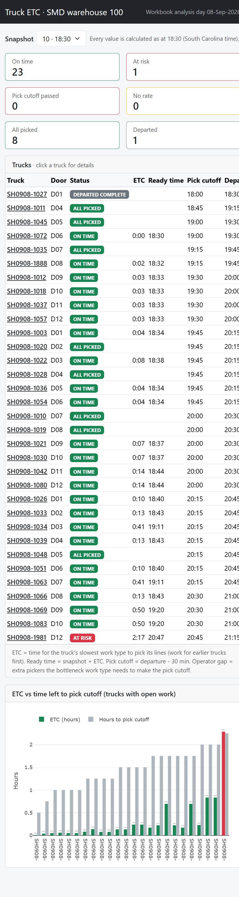
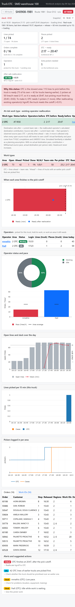
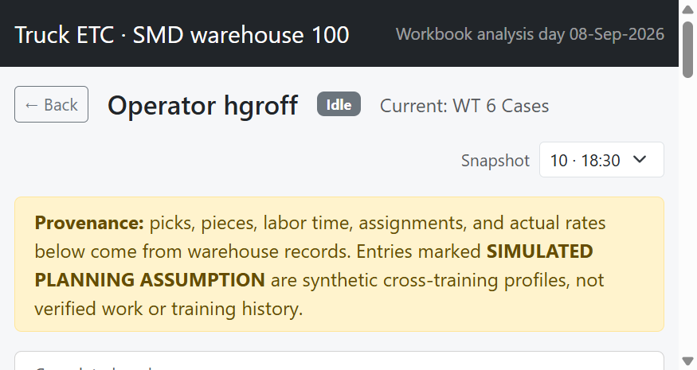

# Truck ETC, Pick Cutoff, and Labor Reallocation

## Complete application reference and handover guide

**Application:** Truck ETC supervisor app for SMD warehouse 100  
**Analysis day:** 08-Sep-2026  
**Document basis:** current source code, current `data/workbook.xlsx`, current SQLite build, live web pages, automated tests, and the historical files under `INFO/`  
**Document date:** 09-Oct-2026  
**Important:** this guide describes what the application actually implements. It separates actual records, replayed records, synthesized inputs, simulated familiarity, calculated results, and illustrative examples.



---

## 1. Project overview

### 1.1 What the application does

The application answers one practical warehouse question:

> Based on the work still open and the picking speed observed so far, will each truck be ready before its pick cutoff?

It replays one SMD operating day at 18 fifteen-minute snapshots, from 16:15 through 20:30. At each snapshot it:

1. Counts the open and completed pick lines in each work type.
2. Calculates the observed picking rate for each work type.
3. Assigns each order and line to its effective truck.
4. Calculates when each work type should finish the work that has priority before a truck.
5. Uses the slowest required work type as the truck's estimated time to completion (ETC).
6. Compares the projected ready time with the truck's pick cutoff.
7. Marks the truck `ON TIME`, `AT RISK`, `NO RATE`, or another lifecycle status.
8. For an at-risk work type, tests whether an existing operator can move safely from another work type.
9. Shows the projected source and destination effects. It does not create temporary operators.

The intended users are warehouse supervisors, labor planners, business analysts, developers, and support staff. A supervisor can use the result to decide where to investigate, whether to move a qualified operator, whether work must be reprioritized, and which truck is most exposed.

### 1.2 What problem it solves

A truck may contain work from several warehouse areas. One area can finish quickly while another is delayed by a queue of earlier trucks. Looking only at the truck's own open lines can therefore be misleading. This application includes the same-work-type lines belonging to trucks with the same or earlier cutoff (`LINES_AHEAD`) and uses the slowest required area as the truck bottleneck.

### 1.3 Current verified dataset

| Item | Current value | Provenance |
|---|---:|---|
| Analysis date | 08-Sep-2026 | Configuration |
| Client | SMD | Configuration |
| Warehouse | 100 | Configuration/source filter |
| Snapshots | 18, every 15 minutes from 16:15 to 20:30 | Configuration |
| Trucks/routes | 33 | Actual route identities; synthesized doors and departures |
| Customer orders | 421 | Actual, with derived order key fields |
| Work IDs | 625 | Actual assignments |
| Item/pick lines | 1,163 | Actual |
| Distinct operators | **12** | Actual labor records |
| Simulated familiarity rows | 15 | Explicit planning assumptions |
| Accepted reallocation moves | 3 | Derived recommendations under conservative source-safety checks |

Routes `SH0908-1001`, `SH0908-1075`, and `SH0908-1085` and all dependent data were removed from the active workbook because actual picks occurred after the synthesized departures. The historical files retain the earlier 36-route version.

### 1.4 What it can and cannot do

Implemented:

- Snapshot selection and truck status dashboard.
- Truck, work-type, order, work-ID, operator, alert, and trend drill-downs.
- Actual observed line and piece rates.
- Truck and work-type ETC, ready time, cutoff, slack, bottleneck, and operator-gap calculations.
- Explicitly labelled simulated cross-training familiarity.
- Safe, headcount-neutral reallocation recommendations.
- Operator profiles with actual productivity and missing-data messages.
- Excel/Python parity, data-integrity checks, and automatic SQLite rebuilds.

Not implemented:

- A live warehouse feed or automatic refresh from production systems.
- A command that changes an operator's real assignment. Reallocation is a recommendation/simulation only.
- Temporary or newly hired operators.
- Authentication, roles, approvals, audit history, or supervisor sign-off.
- Actual truck-arrival, staging-start, loading-progress, or carrier telemetry.
- A standalone work-type page.
- Free-form what-if planning for changing departures, moving orders, or partial shipping.
- Productive-only labor time. The source provides observed labor time, not a separately verified productive-time measure.

---

## 2. How to use the application

### 2.1 Dashboard

1. Open `/`.
2. Choose a snapshot. The form submits immediately and recalculates the displayed view from stored results.
3. Read the six status cards.
4. Compare each truck's ETC with time left to cutoff in the chart.
5. Click any truck row to open its detail page.

The default snapshot is 9 (18:15) unless `DEFAULT_SNAPSHOT` is changed in the environment.

### 2.2 Truck page

The truck page shows:

- Identity, route, door, carrier, departure, cutoff, status, and slack.
- KPIs for lines, pieces, orders, ETC, operators, operator gap, and after-reallocation status.
- A plain-language explanation of the current status.
- An at-risk/reallocation table when relevant.
- Work-type detail and finish-time chart.
- Operators and operator charts.
- Historical trends through the selected snapshot.
- Orders, work IDs, alerts, and suggested actions.

Changing the snapshot reloads the same truck at the selected point in time.

### 2.3 Operator page

Click an operator name in the truck's Operators table or in the reallocation table. The page shows actual completed work, observed time, actual pace, familiarity and its provenance, current assignment, remaining assigned work, cutoff context, reallocation eligibility, assignment history, and any selected recommendation.

The browser Back button on the page uses browser history; it does not store a special return URL.

### 2.4 Reallocation is advisory

The application recalculates the result as if a move occurred. It does not write the move into LM005S1, TI102, a warehouse management system, or an operator task queue. A supervisor must confirm and execute any real operational change.

---

## 3. Complete application workflow

```text
Workbook inputs
  CONFIG, TRUCK_CONFIG, LM005S1, TI102, TI102C,
  OB_SHIPMENT, OB_ORDER, OB_LINE_MAP, M123, M123T,
  OPERATOR_EXPERIENCE
        |
        v
ETC_CALC: rate and open work per snapshot x work type
        |
        v
TRUCK_WT_ETC: work ahead, work-type ETC, ready time, cutoff result
        |
        v
Safe reallocation engine: qualifications + source safety + destination benefit
        |
        v
TRUCK_ETC: slowest required work type, truck ready time, slack and status
        |
        v
SQLite calculated and source tables
        |
        +--> Dashboard
        +--> Truck detail
        +--> Operator profile
```

When Flask starts, it hashes the workbook with SHA-256. If the stored hash is missing or different, the engine recalculates all results, rebuilds the SQLAlchemy result tables, and replaces the drill-down source tables in SQLite.

### Simple example of the flow

At 18:30, truck `SH0908-1981` has 73 open OTC lines of its own. Forty-two OTC lines on trucks with an equal or earlier cutoff have priority, so `LINES_AHEAD = 73 + 42 = 115`. The observed OTC team rate is 50.339 lines/hour. ETC is therefore about 2.284 hours, so OTC is projected ready at about 20:47. The cutoff is 20:45, making the truck at risk.

The engine identifies hgroff on Cases as familiar with OTC through a **simulated planning assumption**. His actual source pace is 16.541 lines/hour; OTC's actual per-person rate is 25.170. His estimated OTC contribution is the lower value, 16.541. Cases remains safe at both point and conservative rates after the move. OTC's point rate becomes 66.880 lines/hour and point ready time becomes about 20:13. The slower empirical bound remains at risk with one estimated operator still short, so the planning status does not claim the risk is resolved.

---

## 4. Glossary

### 4.1 Core truck and time terms

| Term | Simple and warehouse meaning | Calculation/source | Interpretation |
|---|---|---|---|
| Truck | The outbound vehicle/load being analyzed. In this dataset one route is modeled as one truck. | `OB_SHIPMENT.SHIPMENTID`; actual route identity | A truck groups the orders and lines that must be ready together. |
| Truck ID / Shipment ID | The displayed identifier such as `SH0908-1981`. The app uses Shipment ID as the truck key. | `SHIPMENTID` | Used in URLs, joins, and every truck result row. |
| Route ID | Original SMD route number associated with the modeled truck. | `OB_SHIPMENT.ROUTEID` | Actual route identity; route equals truck in this model. |
| Door | Dock door such as D12. | `OB_SHIPMENT.DOCK_DOOR` | **Synthesized**, not an observed dock assignment. |
| Carrier | Carrier text. | `OB_SHIPMENT.CARRIER` | Currently `n/a`; carrier data was unavailable. |
| Snapshot | A point-in-time replay of the warehouse state. | `CONFIG`, 1-18 | Every result means “as known at this time,” not final-day hindsight. |
| ETC | Estimated time to completion; a duration, not a clock time. | Remaining priority work / observed rate | High ETC means more time is needed. Blank/em dash can mean no calculation is possible. |
| Ready time | Clock time when picking is projected to finish. | Snapshot time + ETC | Compare this timestamp with pick cutoff. |
| Pick cutoff | Latest time picking should finish so loading time remains. | Departure - loading minutes | A readiness deadline, not the departure itself. |
| Departure | Modeled time the truck leaves. | Synthesized cutoff + 30 loading minutes | Later than cutoff because loading needs time. |
| Loading minutes | Reserved staging/loading interval. | `TRUCK_CONFIG.LOADING_MINUTES = 30` | Configuration; changing it changes every cutoff. |
| Slack | Time between projected ready time and cutoff. | Pick cutoff - ready time | Positive = early; zero = exactly on cutoff; negative = late. |
| Time available / hours to cutoff | Time from snapshot to cutoff. | Pick cutoff - snapshot | This is available future time; it is not ETC. |
| Required completion time | The pick cutoff. | Departure - loading time | The work must be ready by this clock time. |
| Bottleneck | Required work type with the largest ETC, or an open work type with no rate. | Maximum work-type ETC | It controls truck readiness. |
| Truck readiness | Whether all required work types will be complete by cutoff. | Slowest work type determines ready time | One late work type makes the truck late. |
| Cutoff met | `YES`, `NO`, or `UNKNOWN` result for a work type or truck. | Ready ≤ cutoff, subject to lifecycle rules | `UNKNOWN` means no defensible rate. |
| Operator gap | Extra pickers estimated on the bottleneck. | Required operators - current resources, minimum zero | It is a modeled need, not an instruction to create staff. |
| Open lines | Released item lines not yet completed at the snapshot. | Count of TI102 rows with `OPENQTY > 0` | Lines, not pieces or orders. |
| Released lines | Truck lines currently known/released. | Picked lines + open lines | Future unreleased orders are excluded at the snapshot. |
| Lines picked | Completed item lines by the snapshot. | TI102C completion time ≤ snapshot | One completed item row counts as one line. |
| Open quantity | Remaining pieces across open lines. | Sum of `TI102.OPENQTY` | A line may contain several pieces. |
| Completed/processed quantity | Pieces picked. | Sum of `PROCESSEDQTY` | Different from completed-line count. |
| Remaining work | Open lines/pieces or priority lines ahead, depending on context. | TI102 and truck priority logic | Always check whether the display means own work or own-plus-earlier work. |

### 4.2 Work-type and labor terms

| Term | Meaning | Calculation/source | Important distinction |
|---|---|---|---|
| Work type / Area / Region | Operational picking area. | M123/M123T | Codes: 1 Prescription, 2 OTC, 3 Vault, 4 Cage, 5 Cooler, 6 Cases. |
| Open | Open lines belonging to this truck and work type. | `OPEN_LINES` | Does not include earlier trucks. |
| Ahead | Lines for earlier/equal-cutoff trucks that must also be processed first. UI shows `LINES_AHEAD - OPEN_LINES`. | Truck priority calculation | The stored `LINES_AHEAD` includes the current truck; the displayed Ahead column shows only the other-truck portion. |
| Picked | Completed lines for this truck/work type by the snapshot. | TI102C filtered by truck and time | Not the same as all area production. |
| Done | Completion percentage for the truck/work type. | Picked / (picked + open) | Blank if the denominator is zero. |
| W/A/I | **Working / Assigned but not started / Idle.** | Operator status logic | This meaning is verified in `calculations/detail.py`; it is not guessed. |
| Resources | Distinct active operators on a work type. | LM005S1 distinct `RESOURCENAME` where WIPIND = Y | Team headcount at a snapshot. |
| Team rate | Observed total work-type line rate. | Per-person rate × active resources | Operator count is already included; do not multiply it again. |
| Per picker | Observed average line rate per active picker. | Total completed lines / total observed labor hours | Area average, not a specific operator's pace. |
| Individual pace | One operator's actual pace in a work type. | Operator completed lines / their observed hours in that work type | Used when removing a source operator. |
| Actual rate | Rate derived from actual completions and labor time. | TI102/TI102C + LM005S1 | Not a target or random value. |
| Historical/expected rate | No separate historical-rate metric is displayed. M150 goals are workbook reference only. | M150 | The web app uses observed actual rates. |
| Lines per hour (l/h) | Number of item lines completed in one hour. | Lines / hours | Lines are item records, not pieces. |
| Pieces per hour | Number of pieces completed in one hour. | Pieces / hours | Calculated in ETC_CALC but the truck readiness logic is line-based. |
| Workload / labor capacity | Work remaining versus the rate available to process it. | Lines and rate | The app does not calculate a separate named “capacity score.” |
| Required operators | Average picker count needed to finish priority lines by cutoff. | Ceiling of lines ahead / (per-person rate × hours left) | Rounded up to a whole person. |
| +Pickers / Additional operators | Required operators minus current resources. | Maximum of zero and the gap | Displayed only when the work type misses cutoff. |
| Resource allocation | Current active work-type assignment inferred from LM005S1. | Latest active labor segment | It is not a permanent skill record. |
| Reallocation | Proposed move of an existing operator from source work type to at-risk destination. | Reallocation engine | Headcount stays constant. |
| Temporary operator | Not present in the current model. | Removed legacy feature | Historical documentation mentioning TEMP operators is obsolete. |
| Operator experience/familiarity | Actual completed destination work or a simulated planning qualification. | TI102C or OPERATOR_EXPERIENCE | Provenance is displayed. Experience level itself does not multiply pace. |
| Idle capacity / surplus labor | Not a standalone metric. An idle/low-work operator may be considered only if source safety, familiarity, and rate evidence pass. | Candidate rules | “More operators” alone is not proof of availability. |
| Labor shortage | At-risk work needing more safe capacity. | Additional operators/operator gap | It does not authorize new labor. |

### 4.3 Statuses

| Status | Implemented meaning | Badge/color |
|---|---|---|
| `ON TIME` | Open work has a usable rate and projected ready time is at/before cutoff. | Green |
| `AT RISK` | Open work has a usable rate but projected ready time is after cutoff. | Red |
| `PICK CUTOFF PASSED - LATE` | Current snapshot is at/after cutoff while work remains. The active workbook includes one explicitly synthesized status-coverage example: SH0908-1072 at snapshot 11 (18:45). | Red |
| `NO RATE` | Work is open but a positive rate cannot be calculated. | Amber |
| `ALL PICKED` | Released work is complete; truck has not departed. | Green |
| `NO WORK RELEASED YET` | No picked or open released lines exist at the snapshot. | Light |
| `DEPARTED COMPLETE` | At departure, no eligible released line was left unpicked. | Gray |
| `DEPARTED - n LINES LEFT BEHIND` | At departure, n eligible released lines were not picked. | Dark |
| Work-type `YES` | Ready at/before cutoff. | Green in chart |
| Work-type `NO` | Ready after cutoff. | Red in chart |
| `NO - CUTOFF PASSED` | Cutoff is already reached/passed with work open. | Red |
| `UNKNOWN - NO RATE` | Open work has no usable rate. | Amber |

Truck status uses the first applicable rule in this order: departed, no work released, all picked, cutoff passed, no rate, on time/at risk.

---

## 5. Formulas and equations

### 5.1 Labor hours

**Implemented formula**

`TOTALTIMEINHRS = SUM(LM005S1.TOTALTIMEINSEC) / 3600`

Seconds are divided by 3,600 because one hour contains 3,600 seconds. Rows are filtered to the analysis date, client, warehouse, snapshot, and work type.

Example: 7,200 seconds / 3,600 = 2 labor hours.

### 5.2 Completed lines and pieces

`TOTALLINES = completed TI102 rows + TI102C rows with MOVED_TO_C_AT <= snapshot`

`TOTALPIECES = qualifying TI102.PROCESSEDQTY + qualifying TI102C.PROCESSEDQTY`

Only completion status 3 is accepted. The completion timestamp prevents future picks from appearing in an earlier snapshot.

### 5.3 Resources

`RESOURCES = COUNT(DISTINCT RESOURCENAME where WIPIND = 'Y')`

This is active headcount by work type, not the count of people who ever worked there.

### 5.4 Per-person and team rates

`PER_PERSON_RATE = TOTALLINES / TOTALTIMEINHRS`

`ACTUALRATELINES = PER_PERSON_RATE × RESOURCES`

Example: 80 completed lines / 4 observed labor hours = 20 lines/hour per picker. With 3 active resources, team rate = 20 × 3 = 60 lines/hour. The team rate already includes headcount.

Piece rate uses the same equations with `TOTALPIECES`.

Missing rules: per-person rate is unavailable when hours are zero or no lines are complete. Team rate is unavailable when hours or resources are zero.

### 5.5 Work-type priority workload

`OPEN_LINES = open lines of this truck and work type`

`LINES_AHEAD = sum of open lines in the same work type for every truck whose cutoff <= this truck's cutoff`

Equal cutoffs are included. This models earliest-cutoff-first priority. The UI's Ahead column is `LINES_AHEAD - OPEN_LINES`.

### 5.6 Work-type ETC and ready time

`WT_ETC hours = LINES_AHEAD / ACTUALRATELINES`

Internally the truck sheets store the duration as Excel days:

`WT_ETC days = LINES_AHEAD / ACTUALRATELINES / 24`

`WT_READY_TIME = snapshot time + WT_ETC days`

Example: 120 priority lines / 60 lines/hour = 2 hours. At 16:00, ready time is 18:00.

If this truck has zero open lines in the area, its work-type ETC is blank even if the area has work for other trucks. If it has open lines but rate is unavailable, ETC is `None`/NULL and the page shows an em dash or no-rate explanation.

### 5.7 Work-type cutoff result

For open work:

1. If snapshot >= cutoff: `NO - CUTOFF PASSED`.
2. Else if rate is missing/nonpositive: `UNKNOWN - NO RATE`.
3. Else if ready <= cutoff: `YES`.
4. Else: `NO` and work-type status `AT RISK`.

Time comparisons allow `1e-9` day, approximately 0.086 milliseconds, to prevent tiny Excel/Python floating-point differences from flipping equality.

### 5.8 Required operators and operator gap

`OPERATORS_NEEDED = CEILING(LINES_AHEAD / (PER_PERSON_RATE × HOURS_TO_CUTOFF))`

`ADDITIONAL_OPERATORS = MAX(0, OPERATORS_NEEDED - RESOURCES)`

Example: 115 lines, 25.17 lines/hour/picker, 2.25 hours left:

1. One picker can complete 25.17 × 2.25 = 56.63 lines.
2. 115 / 56.63 = 2.03 pickers.
3. Ceiling(2.03) = 3 required pickers.
4. 3 required - 2 current = 1 additional picker.

The calculation subtracts `1e-9` before `ceil` so an exact whole number such as 4.0000000001 caused only by floating precision does not become 5.

### 5.9 Truck ETC, ready time, bottleneck, and slack

`TRUCK_ETC = MAX(WT_ETC for the truck's required work types)`

`READY_TIME = snapshot + TRUCK_ETC`

`SLACK = PICK_CUTOFF - READY_TIME`

The work type that supplies the maximum is the bottleneck. If any required work type has no rate, truck ETC and ready time are unknown and that no-rate work type becomes the bottleneck label.

Clock example:

- Snapshot: 16:00
- Truck ETC: 2 hours 10 minutes
- Ready: 18:10
- Pick cutoff: 18:30
- Slack: +20 minutes, so the truck is on time.

If ready were 18:45, slack would be -15 minutes and the truck would be at risk.

Slack minutes use Excel-style half-away-from-zero rounding. Displayed ETC/duration helpers truncate sub-minute seconds, so a displayed `2:17` can represent slightly more than 2 hours 17 minutes.

### 5.10 Departure and cutoff

Current synthesized rule:

`pick cutoff = round the route's last order release + 60 minutes up to the next 15-minute boundary`

`departure = pick cutoff + 30 loading minutes`

At a snapshot, a changed departure would apply only from `DEPARTURE_CHANGED_AT`; the current real-day data has no active changed-departure case.

### 5.11 Completion percentage

Truck: `PCT_PICKED = LINES_PICKED / LINES_RELEASED`.

Work type: `Done = picked / (picked + open)`.

Both are blank/zero-handled when there is no denominator.

### 5.12 Operator metrics

`operator actual rate = completed lines by snapshot / observed labor hours at snapshot`

`operator work-type pace = completed lines in work type / observed hours in work type`

`operator remaining ETC = held open lines / current-work-type pace`

`vs area = operator pace / area per-person rate`

The profile's total observed labor time sums LM005S1 time at the selected snapshot. Productive-only time is unavailable and is explicitly shown as such.

### 5.13 Operator status and flags

- Logged out: no WIPIND Y labor row.
- Working: logged in and holds an open TI102 line with status 2.
- Assigned, not started: logged in and holds open work, but none has status 2.
- Idle: logged in and holds no open work.

Alerts:

- Assigned-not-started longer than 10 minutes.
- Logged in with no pick for at least 30 minutes.
- Idle while unassigned work waits in the same area.
- Logged out while holding work.
- Low pace: after at least 0.5 observed hour, operator pace is below 60% of area per-person rate.
- Repeated short-pick location: at least two short lines at the same source location.

### 5.14 Reallocation formulas

Qualification can come from:

- Actual destination completions, or
- `OPERATOR_EXPERIENCE`, clearly labelled `SIMULATED PLANNING ASSUMPTION`.

Actual destination contribution:

`completed destination lines / destination labor hours`

When only simulated familiarity exists:

`estimated destination contribution = MIN(actual source pace, actual destination per-person rate)`

Then:

`destination rate after = destination team rate before + destination contribution`

`source rate after = source team rate before - operator actual source pace`

`ETC after = LINES_AHEAD / rate after`

`time saved = ETC before - ETC after`

Every open source truck is recalculated with the reduced source rate. A candidate is rejected if any source truck stops meeting its cutoff, source pace is unavailable, destination estimate cannot be supported, the operator is already used, or the operator lacks familiarity.

Candidate ordering prefers:

1. A move that makes the destination safe.
2. Lower source priority workload.
3. Greater source slack.
4. Higher destination contribution.
5. Operator name as a deterministic final tie-breaker.

An operator can move at most once per snapshot. Resources decrease by one at source and increase by one at destination; total headcount is conserved.

---

## 6. Data inventory and provenance

### 6.1 Provenance categories

| Category | Meaning |
|---|---|
| Actual | Directly derived from the supplied SMD extract: item, pick, labor, order, route, customer, work type. |
| Actual (replayed) | Actual records reconstructed at each 15-minute snapshot. Values repeat across snapshots as the live state evolves. |
| Synthesized | Created because the source lacked a required operational field: departures and dock doors. |
| Simulated planning assumption | Cross-training familiarity created for scenario analysis. It is not verified training/history. |
| Derived | Calculated from inputs with documented equations. |
| Configuration | A selected filter, status code, snapshot, loading interval, or path/default. |
| Historical/obsolete | Preserved under `INFO/`; not loaded by the runtime app. |

### 6.2 Active workbook sheets

| Sheet | Grain and role | Category/reliability | Main consumers |
|---|---|---|---|
| CONFIG | Parameters plus 18 snapshot timestamps | Configuration | All calculations |
| TRUCK_CONFIG | Loading, order lead, reallocation evidence rule | Configuration | Truck/reallocation calculations |
| LM005S1 | 282 snapshot labor rows | Actual replayed | Rates, resources, operator profiles |
| TI102 | 4,068 open/live snapshot rows | Actual replayed | Open work, holders, statuses |
| TI102C | 1,163 completed item rows | Actual | Rates, picked work, familiarity evidence |
| OB_SHIPMENT | 33 truck rows | Mixed: actual routes; synthesized departures/doors | Truck deadlines and identity |
| OB_ORDER | 421 order rows | Actual; some derived key/mapping fields | Truck/order relationships |
| OB_LINE_MAP | 1,163 item-to-order/work-ID mappings | Actual | All truck attribution |
| M123 / M123T | Six work-type codes/descriptions | Source master | Labels/mapping |
| M150 | Work-type goal rates | Source master/reference only | ETC_CALC reference columns |
| OPERATOR_EXPERIENCE | 15 operator/work-type familiarity rows | Simulated planning assumptions | Reallocation eligibility, profiles |
| ETC_CALC | 108 snapshot/work-type results | Derived | Truck work-type calculations |
| TRUCK_WT_ETC | 3,564 snapshot/truck/work-type rows | Derived | Truck results and detail page |
| TRUCK_ETC | 594 snapshot/truck rows | Derived | Dashboard and truck page |
| TRUCK_REALLOCATION | Two at-risk snapshot/work-type summaries | Derived by Python, stored in workbook | Reallocation reporting |
| TRUCK_REALLOCATION_MOVES | Four accepted moves | Derived by Python, stored in workbook | Source/destination impact reporting |
| OB_OPEN_LINK / OB_DONE_LINK | Workbook helper links | Derived | Workbook formulas |
| TRUCK_VIEW | Workbook supervisor view | Derived presentation | Human workbook use, not web runtime |
| TRUCK_CHECKS | Data/reconciliation checks | Derived validation | Quality assurance |
| TRUCK_README | Workbook explanation | Documentation; contains stale count noted later | Human readers |

### 6.3 Configuration values

| Setting | Value | Effect |
|---|---|---|
| ANALYSIS_DATE | 08-Sep-2026 | Filters labor and completions |
| CLIENTID_FILTER | SMD | Client filter |
| WHID_FILTER | 100 | Warehouse filter |
| WIPIND_WORKING | Y | Active labor flag |
| STATUS_COMPLETED | 3 | Completed-line status |
| LOADING_MINUTES | 30 | Cutoff = departure - 30 min |
| ORDER_LEAD_MINUTES | 60 | Synthesized cutoff lead from last release |
| REALLOCATION_EVIDENCE_RULE | ACTUAL_METRICS_WITH_LABELLED_SIMULATED_FAMILIARITY | Provenance rule |
| DEFAULT_SNAPSHOT | 9 | Web default, from environment/config.py |
| DATABASE_URL | SQLite under `data/truck_etc.db` by default | Storage |

The simulated familiarity mapping is deterministic and stored in the workbook. It does not change between runs. No random-number generator is used.

---

## 7. Page, table, and column reference

### 7.1 Dashboard status cards

The cards count all 33 trucks at the selected snapshot. Departed statuses are grouped into one `Departed` card. `NO WORK RELEASED YET` has no separate card, so card totals need not add to 33.

### 7.2 Dashboard truck table

| Column | Unit/source | Meaning and interpretation |
|---|---|---|
| Truck | ID | Shipment/truck key; click for detail. |
| Door | Text, synthesized | Modeled dock door. |
| Status | Rule result | Current truck lifecycle/readiness status. |
| ETC | Hours/minutes, derived | Slowest required work-type duration. Blank when no open work; em dash behavior depends on page context for no rate. |
| Ready time | Clock time, derived | Snapshot + ETC. Blank when unknown or no open work. |
| Pick cutoff | Clock time, synthesized/derived | Departure minus loading time. |
| Departure | Clock time, synthesized | Modeled departure. |
| Slack | Signed duration, derived | Cutoff - ready. Negative values are red. |
| Bottleneck | Work type, derived | Slowest or no-rate area. |
| Operator gap | People, derived | Extra pickers required on bottleneck when at risk. |
| Open / released | Lines | Remaining released lines / all currently released lines. |

Clicking anywhere on a truck row navigates to `/truck/<shipment_id>?snapshot=<n>`.

### 7.3 Truck KPI cards

| Card | Calculation and source |
|---|---|
| Lines picked | Completed truck lines / completed + open lines. |
| Pieces picked | Sum of completed `PROCESSEDQTY`; subtext shows open pieces and short lines. |
| Orders complete | Complete order count / truck order count; subtext gives complete/total work IDs. |
| ETC → ready | Truck ETC duration and projected ready timestamp; bottleneck underneath. |
| Operators | Distinct operators who picked for this truck; subtext counts relevant operators working now. |
| Extra pickers needed | Bottleneck additional-operator calculation. |
| After safe reallocation | Calculated status/slack after recommended moves, move names, and time saved. |

### 7.4 At-risk reallocation table

| Column | Meaning |
|---|---|
| Work type | At-risk destination code and description. |
| Status before | Baseline work-type status. |
| Operators before | Active destination resources before any move. |
| ETC before | Priority workload / baseline destination team rate. |
| Ready before | Snapshot + ETC before. |
| Operator reallocated | Selected existing operators; names link to profiles. |
| Source eligibility / slack | Why the source remains safe after each removal. |
| Destination familiarity | Actual or simulated qualification evidence plus pace basis. |
| Eligible candidates | Candidates that passed familiarity, rate, and source-safety checks when evaluated. |
| Source before → after | Intended to show limiting source truck, rate, ETC, ready, cutoff, and final source status. See the discrepancy register for a current row-association defect. |
| Operators after | Destination resources before + accepted incoming operators. |
| Rate after | Destination team rate before + each contribution. |
| ETC after | Priority workload / destination rate after. |
| Ready after | Snapshot + ETC after. |
| Pick cutoff | Destination deadline. |
| Time saved | ETC before - ETC after. |
| Final status | Work-type result after the recommendation. |

### 7.5 Work types table

These are existing Details-section columns and are preserved in their original order.

| Column | Unit | Exact meaning |
|---|---|---|
| Area | Code/name | Work type. |
| Open | Lines | This truck's open lines in the area. |
| Ahead | Lines | Other priority lines: `LINES_AHEAD - OPEN_LINES`. |
| Picked | Lines | This truck's completed lines in the area. |
| Done | Percent | Picked / (picked + open). |
| W/A/I | People | Working / assigned-not-started / idle among relevant operators. |
| Team rate | Lines/hour | Observed area rate including current active resources. |
| Per picker | Lines/hour/person | Observed average area pace. |
| ETC | Duration | Lines ahead / team rate. |
| Ready | Clock time | Snapshot + ETC. |
| Meets cutoff | Text | YES, NO, passed, unknown, or blank. |
| +Pickers | People/text | Extra operators needed or no-rate explanation. |
| After reallocation | Text | Incoming names, new ready time, and final status, or “No eligible move.” |

### 7.6 Operators table

| Column | Meaning/formula |
|---|---|
| Operator | Resource name; link to profile. |
| Area | Current work type from latest labor segment at snapshot. |
| Status | Working, assigned-not-started, idle, or logged out. |
| Login | Latest active segment start time. |
| Lines (truck) | Lines this person completed for the selected truck. |
| Pieces (truck) | Pieces this person completed for the selected truck. |
| Lines today | All lines this person completed by the snapshot. |
| Pace l/h | Actual lines in current work type / observed hours in it. |
| vs area | Operator pace / area per-person rate. |
| Shorts | Selected-truck lines with `SHORTQTY > 0`. |
| Holding | Open lines assigned to the operator. |
| Est. finish | Snapshot + held lines / individual pace. Blank when not calculable. |
| Min since pick | Minutes since later of last pick and login. |
| Flags | Threshold-based operational warnings. |

### 7.7 Orders table

| Column | Meaning |
|---|---|
| Order | Warehouse order ID. |
| Customer | Customer name when available. |
| Stop | Stop sequence/value from OB_ORDER. |
| Released | Order release time. |
| Regions | Work-type codes represented by the order. |
| Work IDs | Distinct assignments attached to the order. |
| Done / items | Completed line count / total mapped item lines. |
| Open | Currently open line count. |
| State | In progress, Not started, Not released, or Complete. |
| Notes | Moved-order, late-added, or cut/cancelled scenario notes when present. |

Order state rules: release after snapshot = Not released; no open and at least one completed = Complete; no completed = Not started; otherwise In progress.

### 7.8 Work IDs table

| Column | Meaning |
|---|---|
| Work ID | Assignment ID; badge marks an assignment containing several customers. |
| Region | Work type. |
| Customer(s) | Up to three customer names, then `+n`. |
| Orders | Count of distinct orders in the assignment. |
| Done / items | Completed mapped item lines / total mapped lines. |
| Open | Open mapped lines. |
| State | In progress, Waiting, Not released, or Complete. |
| Picker(s) | Current holders and/or people who completed its lines. |

`Waiting` means released but nobody has started it. A case-pick work ID can contain several customers while every item retains its order and truck.

### 7.9 Alerts and suggested actions

Alerts are generated, not manually entered. They cover late work-type finish, no-rate areas, earlier-truck work ahead, operator inactivity/low pace/held work, repeated short-pick locations, unresolved at-risk status, and departed missed lines. Suggested actions are guidance strings; clicking them does not execute an operation.

### 7.10 Operator profile

| Section/field | Meaning |
|---|---|
| Completed work | Actual completed line and piece totals by snapshot. |
| Observed labor time | Sum of current snapshot LM005S1 time for the operator. |
| Productive-only time | Explicitly unavailable. |
| Actual production rate | Completed lines / observed labor hours. |
| Assigned remaining | Open TI102 lines and pieces assigned to the operator. |
| Familiarity | Actual completed work and separate simulated qualifications. |
| Current work type/status | Latest labor assignment and inferred current state. |
| Operator ETC | Assigned remaining lines / actual current-work-type pace. |
| Next work cutoff | Earliest open cutoff in the operator's current area, not necessarily a line personally held by that operator. |
| Area cutoff status | Worst work-type cutoff result for that area. |
| Actual productivity by work type | Lines, pieces, hours, and actual pace by work type. |
| Reallocation eligibility | Familiar destinations, at-risk count, estimated contribution, decision, and reason. |
| Assignment history | Changes in selected current work type across available snapshots. |
| Selected reallocation | Recommendation at the chosen snapshot; not an executed move. |

---

## 8. Dashboard and graph reference

### 8.1 ETC vs time left to pick cutoff

- **Page:** Dashboard.
- **Chart:** grouped vertical bar chart plus no-rate markers.
- **Business question:** Is required picking time larger than time available?
- **X-axis:** active trucks, labeled shipment and departure.
- **Y-axis:** hours.
- **Series:** ETC hours and nonnegative hours to cutoff.
- **Colors:** green ETC bar only for `ON TIME`; red for other known ETC statuses; yellow X for unavailable ETC; gray for hours to cutoff.
- **Important limitation:** hours to cutoff is clipped at zero in the chart. A passed cutoff therefore appears as zero, not a negative bar.
- **Interaction:** standard Plotly hover works; the mode bar is hidden; chart elements do not navigate.

### 8.2 When each area finishes vs the pick cutoff

- **Page:** Truck detail.
- **Chart:** horizontal duration bars from snapshot time to ready time.
- **Y-axis:** required work types.
- **X-axis:** clock time.
- **Green/red/amber:** YES / NO / unknown or passed status.
- **Dashed line:** truck pick cutoff.
- **Blue diamond:** ready time after reallocation where a move enters the area.
- **Decision:** identify the late area and whether the recommendation brings it left of the cutoff line.

### 8.3 Operator status and pace

This card contains two charts.

1. **Status donut:** slices count Working, Assigned-not-started, Idle, and Logged-out operators relevant to this truck. Green, yellow, gray, and light gray are assigned explicitly in JavaScript.
2. **Pace chart:** blue bars show individual actual line pace; black markers show area average. A bar is red when the operator has at least 0.5 hour and is below 60% of average.

Do not interpret a missing pace bar as zero productivity; it means no defensible pace could be calculated.

### 8.4 Open lines and slack over the day

- **Chart:** bars plus line on a secondary axis.
- **X-axis:** snapshots through the selected snapshot.
- **Left Y-axis:** truck open lines.
- **Right Y-axis:** slack minutes.
- **Reading:** falling bars mean open work decreased. Rising slack means the forecast improved. Missing slack gaps mean no comparable ready-time calculation existed.

### 8.5 Lines picked per 15 min (this truck)

- **Chart:** stacked bars by work type.
- **X-axis:** snapshot intervals.
- **Y-axis:** completed lines in each interval.
- **Formula:** count completions where previous snapshot < `MOVED_TO_C_AT` <= current snapshot.
- **Reading:** taller bars mean more truck lines completed during that interval. It is throughput for this truck, not the full area.

### 8.6 Pickers logged in per area

- **Chart:** step lines.
- **X-axis:** snapshots.
- **Y-axis:** distinct WIPIND Y operators.
- **Series:** each work type present in the truck's throughput data.
- **Reading:** a step up/down shows a change in active resources. It does not prove a reallocation recommendation was executed.

### Screenshots





---

## 9. Truck ETC and cutoff analysis

Truck ETC is line-based. `ETCPIECES` exists in ETC_CALC but does not control the truck result. For every truck/work type, the engine calculates priority lines and a finish time. The truck is ready only when all required work types are ready, so the largest work-type ETC wins.

Similar-looking times:

| Value | Type | Example |
|---|---|---|
| Snapshot | Clock time | 18:30 |
| ETC | Duration | 2 h 17 min |
| Ready time | Clock time | 20:47 |
| Pick cutoff | Clock time | 20:45 |
| Departure | Clock time | 21:15 |
| Slack | Signed duration | -2 min |

The 30 minutes between cutoff and departure is loading allowance. Negative slack does not necessarily say the truck has physically departed; it says projected pick completion is beyond the picking deadline.

Departed results are frozen at the departure event. The engine counts lines released for the effective truck and not picked by departure, so later picks cannot erase a missed-departure event.

---

## 10. Work-type ETC and labor capacity

Work types share a team rate across trucks at a snapshot. A row for one truck does not calculate a truck-specific picking team; it applies the current area rate to the priority queue for that truck. This is why `RESOURCES`, `ACTUALRATELINES`, and `PER_PERSON_RATE` repeat across trucks for the same snapshot/work type.

The application assumes same/equal-cutoff work is ahead. It does not model location travel, equipment, breaks, replenishment delays, or assignment-level sequencing inside that priority rule. Those real-world effects are reflected only indirectly in the observed rate.

M150 goal rates are reference-only workbook fields. They do not replace observed rates and do not determine truck status.

---

## 11. At-risk detection and labor reallocation

### 11.1 At-risk detection

A work type is at risk when it has open work, a positive rate, cutoff has not passed, and `ready time > pick cutoff`. A truck is at risk when its bottleneck ready time is after cutoff and no higher-priority lifecycle status applies.

### 11.2 Candidate eligibility

An active operator on another work type is considered only when:

1. They have not already been used at the snapshot.
2. They are not already in the destination.
3. Actual source pace exists when source work remains.
4. Familiarity is supported by actual destination completions or the simulated matrix.
5. Destination contribution is actual or can be bounded by actual rates.
6. Source rate remains positive when source work remains.
7. Every open source truck still meets its cutoff after removal.

There is no arbitrary “move one person because another area has more people” rule.

### 11.3 Current recommendations

| Snapshot | Destination | Selected move(s) | Outcome |
|---|---|---|---|
| 6, 17:30 | OTC | amack, esica, psam from Prescription | SH0908-1010 and SH0908-1039 become on time; SH0908-1981 remains at risk because no further safe move exists. |
| 10, 18:30 | OTC | hgroff from Cases | SH0908-1981 becomes on time. |

Total resources before and after are equal at every snapshot.

### 11.4 Real worked example: SH0908-1981 at snapshot 10

Inputs:

- Snapshot = 18:30.
- OTC open on truck = 73 lines.
- Earlier/equal-cutoff OTC lines = 42.
- `LINES_AHEAD = 115`.
- OTC resources = 2.
- OTC per-person rate = 25.1696 lines/hour.
- OTC team rate = 50.3393 lines/hour.
- Cutoff = 20:45, giving 2.25 hours.

Before:

1. ETC = 115 / 50.3393 = 2.2845 hours, displayed 2:17.
2. Ready ≈ 18:30 + 2:17 = 20:47.
3. Ready is about two minutes after 20:45, so status is AT RISK.
4. Operators needed = ceiling(115 / (25.1696 × 2.25)) = ceiling(2.03) = 3.
5. Gap = 3 - 2 = 1.

Candidate hgroff:

- Actual source work type = Cases.
- Actual source pace = 16.5409 lines/hour.
- OTC familiarity = simulated working knowledge, explicitly not verified history.
- Estimated OTC contribution = min(16.5409 actual source pace, 25.1696 actual OTC per-person rate) = 16.5409 lines/hour.

After:

1. OTC rate = 50.3393 + 16.5409 = 66.8802 lines/hour.
2. ETC = 115 / 66.8802 = 1.7195 hours, displayed 1:43.
3. Ready ≈ 20:13.
4. Time saved ≈ 2.2845 - 1.7195 = 0.565 hours = 33.9 minutes.
5. Slack ≈ +31 minutes, so final status is ON TIME.
6. Cases rate is reduced by hgroff's actual source pace and the source safety test passes.

### 11.5 Meaning of “after reallocation”

It means a calculated planning scenario. It does not assert that the operator physically moved, that a supervisor approved the move, or that the destination will achieve the estimate.

---

## 12. Individual operator and resource details

Actual familiarity is recognized only when the operator completed destination lines by the selected snapshot and a pace can be measured. Simulated familiarity is categorical (`working knowledge` or `experienced backup`) and does not itself set a numerical multiplier. Both levels use the same conservative estimate formula when destination performance is absent.

The operator profile uses actual data wherever possible:

- Names/IDs: LM005S1/TI102/TI102C.
- Current/previous assignment: labor rows by snapshot.
- Lines/pieces: TI102C through snapshot.
- Actual rate: completed lines / observed hours.
- Remaining: TI102 rows currently assigned to the operator.
- ETC: remaining assigned lines / actual current-work-type pace.
- Cutoff context: current work-type rows across trucks.
- Eligibility: active status, familiarity, measurable source pace, destination rate, at-risk demand, and source safety.

If a required value is unavailable, the page uses an em dash or explanatory text rather than fabricating an actual metric.

---

## 13. Business rules, dependencies, and edge cases

### 13.1 Rule precedence

The application evaluates lifecycle conditions before forecast conditions. In practical terms:

1. A truck that left with open lines is a departed exception, even if later activity would make the current projection look safe.
2. A completed truck is complete; it does not need a projected ETC.
3. A truck with no released work is not treated as complete or at risk.
4. Released open work without a measurable rate is `NO RATE`, not an infinite or invented ETC.
5. Only otherwise forecastable work is classified `ON TIME` or `AT RISK`.

This precedence prevents mathematically convenient but operationally false conclusions.

### 13.2 Time and date assumptions

- Workbook timestamps are Excel serial dates based on the 1899-12-30 epoch.
- Snapshot and source timestamps are treated as naive local timestamps. The interface labels them South Carolina time, but the engine performs no timezone conversion.
- Pick cutoff equals the departure time applicable at the snapshot minus `LOADING_MINUTES`.
- A departure change applies only on or after `DEPARTURE_CHANGED_AT`.
- A moved order belongs to its original shipment before `MOVED_AT` and its final shipment on or after `MOVED_AT`.
- Comparisons use exact stored values; display values can be rounded or shortened.

### 13.3 Rate and zero-value cases

| Condition | Result |
|---|---|
| No open lines | ETC is zero/blank as appropriate and the work is complete. |
| Open lines, zero resources | No measurable team capacity; status is `NO RATE`. |
| Open lines, resources, but no elapsed productive history | Rate remains unavailable; it is not replaced with a goal rate. |
| Negative hours to cutoff | Cutoff has passed; lifecycle/status logic takes priority. |
| Destination operator pace unavailable | Candidate is rejected. |
| Removing an operator reduces a source with remaining work to zero rate | Candidate is rejected. |
| Any source truck would miss cutoff after removal | Candidate is rejected. |
| Familiarity unavailable | Candidate is rejected. |

### 13.4 Rounding and display rules

- Core calculations retain floating-point Excel-day precision.
- `SLACK_MINUTES` uses half-away-from-zero minute rounding.
- Clock times normally display to the minute.
- Duration helpers display hours and minutes and therefore hide remaining seconds.
- The dashboard hours-to-cutoff chart clips negative values to zero for plotting; status still uses the true value.
- A displayed ready time equal to a displayed cutoff can still be a few seconds late internally. Inspect slack/status when the boundary matters.

### 13.5 Headcount conservation

For each snapshot:

```text
sum(resources after across work types)
= sum(resources before across work types)
```

Every accepted move contributes `-1` to its source and `+1` to its destination. An operator can be selected at most once per snapshot. Recommendations are scenarios only and do not change historical labor rows.

### 13.6 Operational edge cases not explicitly modeled

The projection does not explicitly model travel between areas, equipment certification, replenishment delays, breaks, congestion, batch setup, learning curves, supervisor approval, or the time needed to hand over source work. A supervisor should therefore treat small positive slack as fragile rather than guaranteed.

---

## 14. Excel workbook versus web application

### 14.1 Responsibility comparison

| Capability | Workbook | Python/web application |
|---|---|---|
| Source and synthesized scenario data | Authoritative active file | Reads and caches selected source tables. |
| Baseline ETC formulas | Formula/cached result sheets | Independently recalculated by the Python engine and parity-tested. |
| Reallocation scenario | Materialized analysis sheets | Computed by the Python reallocation engine, then written to the workbook by maintenance scripts. |
| Drill-down | Wide data tables | Truck, work-type, order, work-ID, and operator pages. |
| Visualization | Primarily tabular | KPI cards, status tables, filters, and charts. |
| Persistence | XLSX | SQLite calculated/result cache. |

### 14.2 Reconciliation status

The baseline engine is compared with cached workbook results for ETC, truck/work-type status, times, and counts. The current validation suite contains 72 workbook-parity assertions and passed at the time of this guide's audit. Formula-error scanning found no active Excel formula errors.

Reallocation parity is not an independent second implementation: the current reallocation sheets contain values generated by the Python logic. Agreement therefore proves successful serialization/reload, not independent mathematical confirmation. This distinction matters when evaluating assurance.

### 14.3 Discrepancy register

| ID | Severity | Location | Finding | Consequence | Recommended correction |
|---|---|---|---|---|---|
| D-01 | Resolved | Reallocation engine | Each candidate now carries its own source row set into `_source_impact`. | Source shipment ETC/ready/cutoff/status fields correspond to the selected operator's actual source context. | Covered by a regression test with competing source work types. |
| D-02 | Resolved | README and workbook prose | Active documentation now states 12 distinct operators. | Documentation and source count agree. | Derive this prose programmatically in a future documentation build. |
| D-03 | Medium | Historical DOCX | It describes 36 routes, 1,432 lines, and temporary added operators. The active model has 33 trucks, 1,163 lines, and headcount-neutral reallocation. | The document is unsafe as current operating guidance. | Mark it archived/legacy and direct users to this guide. |
| D-04 | Medium | Dashboard footer | It hard-codes `pick cutoff = departure - 30 min`. | It will become false if `LOADING_MINUTES` changes. | Render the configured value dynamically. |
| D-05 | Medium | Time labeling | The UI calls times South Carolina time, while the engine stores naive timestamps without timezone conversion. | Wrong interpretation if source timestamps or deployment timezone differ. | Store source timezone explicitly and convert with timezone-aware datetimes. |
| D-06 | Low | Workbook header | `WT_READY_TIME (before adding)` retains legacy wording. | Suggests additive temporary labor rather than reallocation. | Rename only in a versioned workbook schema to `WT_READY_TIME_BEFORE_REALLOCATION`; coordinate parser/tests first. |
| D-07 | Low | Operator profile | `Next work cutoff` is the earliest open cutoff for the operator's current area, not necessarily a line assigned to that operator. | Users may infer stronger assignment specificity than exists. | Relabel `Earliest open cutoff in current work type`. |
| D-08 | Low | Time displays | Minute-only formatting hides seconds; charts clip negative time-to-cutoff to zero. | Borderline late/on-time cases can look tied; passed cutoffs are visually flattened. | Add seconds/tooltips near zero and permit a negative chart axis or explicit passed-cutoff marker. |
| D-09 | Informational | Operator time | Productive-only time cannot be separated reliably from labor-session time. | Utilization cannot be claimed. | Add validated productive/break event sources before exposing utilization. |
| D-10 | Informational | Operational data | Carrier, actual arrival/staging, equipment, travel, and approval/writeback data are absent. | Recommendations remain planning advice, not execution records. | Integrate these sources if operational execution is required. |

### 14.4 D-01 resolution evidence

Candidate tuples retain the source row set used for their safety test, and `_source_impact` receives that selected set. The regression suite verifies that a selected operator from a completed source reports `No remaining source work` even when another evaluated candidate belongs to an open source truck.

---

## 15. Fully worked multi-truck example

This section is an illustrative calculation, not an additional record in the active dataset. Its numbers are chosen only to demonstrate the equations consistently.

### 15.1 Starting state at 18:00

| Truck | Work type | Lines ahead | Team rate | Operators | Pick cutoff | ETC | Ready | Status |
|---|---|---:|---:|---:|---|---:|---|---|
| Truck A | OTC | 120 | 40 lines/h | 2 | 20:30 | 3.00 h | 21:00 | At Risk |
| Truck B | Cases | 30 | 30 lines/h | 2 | 21:30 | 1.00 h | 19:00 | On Time |

OTC has 2.5 hours until cutoff. At the observed per-person average of 20 lines/h:

```text
operators needed = ceiling(120 / (20 * 2.5)) = ceiling(2.4) = 3
operator gap = 3 - 2 = 1
```

### 15.2 Candidate evidence

Operator B2 is currently in Cases. Their actual source pace is 12 lines/hour. They have either measured OTC completions or a clearly labeled simulated OTC familiarity record. OTC's current per-person observed rate is 20 lines/hour, so the conservative destination contribution is:

```text
min(12, 20) = 12 lines/hour
```

Operator B1 lacks OTC familiarity and is rejected even if B1 is faster. Familiarity is a gate, not a score that can be overridden by speed.

### 15.3 Source safety after removing B2

```text
Cases rate after = 30 - 12 = 18 lines/hour
Cases ETC after = 30 / 18 = 1.6667 hours
Cases ready after = 19:40
Cases slack after = 21:30 - 19:40 = 1 hour 50 minutes
```

Truck B remains safe, so B2 passes the source test.

### 15.4 Destination effect after adding B2

```text
OTC rate after = 40 + 12 = 52 lines/hour
OTC ETC after = 120 / 52 = 2.3077 hours
OTC ready after = approximately 20:18:28
time saved = 3.0000 - 2.3077 = 0.6923 hours = 41.54 minutes
```

Truck A changes from at risk to on time with about 11.5 minutes of slack. Total headcount remains four: before it is OTC 2 + Cases 2; after it is OTC 3 + Cases 1.

### 15.5 Why this example is logically acceptable

- The destination was at risk before selection.
- The candidate was an existing active operator.
- Familiarity was established and labeled by evidence type.
- Contribution used actual pace bounded by the destination average.
- Every source truck remained within cutoff after removal.
- The same operator was subtracted from source and added to destination.
- No value was adjusted merely to create an on-time result.

If the source cutoff had been 19:30, the 19:40 source ready time would reject B2, and the system would show no eligible move even though Truck A remained at risk.

---

## 16. Known limitations, open questions, and recommended corrections

### 16.1 Known limitations

1. Simulated familiarity is a planning assumption, not verified training or historical evidence.
2. Destination productivity without actual destination history is estimated conservatively; it is not measured destination performance.
3. Reallocation is advisory and is not posted back to a WMS or labor-management system.
4. Source safety uses the same queue/rate model as ETC and inherits its assumptions.
5. Only line rate drives readiness; piece ETC is calculated for reference but does not control truck status.
6. Work sequencing uses cutoff priority, not precise task location or assignment order.
7. The empirical ETC envelope is a sensitivity range, not a probabilistic confidence interval; it cannot cover delays absent from the source data.
8. Naive timestamps assume a common local time basis.
9. Productive versus nonproductive paid time is not independently available.
10. Small positive slack can be operationally insufficient because transfer/setup time is not modeled.

### 16.2 Questions that require business ownership

- What minimum safety buffer should remain at a source after reallocation?
- Does familiarity require formal certification for any work type?
- Should actual destination history outrank simulated `experienced backup`, and by what rule?
- Should pieces, cube, weight, or equipment constraints ever override line-based ETC?
- How much transfer/setup time should be deducted when an operator changes area?
- Who approves and records a proposed move?
- Should a recommendation be withdrawn automatically when a new snapshot changes the risk?
- Which timezone and daylight-saving rules govern source timestamps?

### 16.3 Recommended correction order

1. Mark the old DOCX as historical and remove temporary-operator language from current guidance.
2. Make cutoff wording and timezone labels configuration-driven.
3. Add validated transfer/setup-time data before deducting it from available capacity.
4. Introduce verified qualification records when available; keep simulated rows visibly separate.
5. Add execution/writeback only after approvals and audit logging are designed.

---

## 17. Technical reference

### 17.1 Application components

| Component | Purpose |
|---|---|
| `app.py` | Flask application factory, formatting helpers, database rebuild command, and dashboard/truck/operator routes. |
| `config.py` | Workbook path, database URL, secret/configuration loading. |
| `calculations/excel_io.py` | Workbook ingestion, Excel serial conversion, and reference-result loading. |
| `calculations/etc.py` | Snapshot/work-type labor, throughput, open work, and ETC engine. |
| `calculations/truck.py` | Work-type priority queues, truck bottleneck, readiness, slack, lifecycle status, and after-scenario aggregation. |
| `calculations/reallocation.py` | Familiarity evidence, operator pace, source-safety gates, candidate ranking, and accepted moves. |
| `calculations/detail.py` | Truck-page tables, alerts, explanations, and trend preparation. |
| `calculations/operator.py` | Operator history, measured metrics, cutoff context, and eligibility explanations. |
| `models/models.py` | SQLAlchemy result-table declarations. |
| `models/database.py` | Database initialization, workbook hash/rebuild, source caching, and query adapters. |
| `templates/` | Jinja dashboard, truck, operator, and base layouts. |
| `static/js/` | Chart construction and page interactions. |
| `static/css/` | Layout, tables, status badges, controls, and responsive presentation. |
| `scripts/` | Workbook maintenance for simulated familiarity and reallocation outputs. |
| `tests/` | Calculation, integrity, parity, detail, route, and reallocation regression tests. |

### 17.2 Web routes

| Route | Purpose |
|---|---|
| `/` | Dashboard at requested `snapshot`, defaulting according to application logic. |
| `/truck/<shipment_id>?snapshot=n` | Full truck drill-down for one snapshot. |
| `/operator/<operator_name>?snapshot=n&truck=<id>` | Operator profile, optionally retaining truck context. |

### 17.3 Database tables

| Table | Grain and role |
|---|---|
| `snapshot` | One row per snapshot number/time. |
| `truck_result` | One row per snapshot and shipment, including before/after scenario results. |
| `worktype_result` | One row per snapshot, shipment, and work type. |
| `reallocation_move` | One row per accepted operator move. |
| `src_lm005s1` | Selected labor-session source fields. |
| `src_ti102` | Selected open-work source fields. |
| `src_ti102c` | Selected completed-work source fields. |
| `src_order` | Selected order/shipment relationship fields. |
| `src_line_map` | Work-ID/order/work-type mappings. |
| `src_operator_experience` | Labeled simulated familiarity rows. |
| `src_config`, `src_snapshot`, `src_worktype` | Cached configuration, timeline, and work-type names. |

The database is a reproducible application cache, not the authoritative raw-data store. A SHA-256 workbook stamp triggers rebuild when the workbook changes.

### 17.4 Run and rebuild

From the project directory, with the configured virtual environment:

```powershell
& '.venv/Scripts/python.exe' -m flask --app app run
& '.venv/Scripts/python.exe' -m flask --app app init-db
& '.venv/Scripts/python.exe' -m pytest
```

Primary runtime dependencies are Flask, SQLAlchemy, pandas, NumPy, openpyxl, python-dotenv, and pytest.

### 17.5 Calculation dependency chain

```text
Workbook source sheets
  -> parsed Inputs
  -> ETC_CALC equivalent by snapshot/work type
  -> truck/work-type priority rows
  -> before-reallocation truck results
  -> familiarity + operator statistics + source safety
  -> accepted headcount-neutral moves
  -> after-reallocation work-type and truck results
  -> SQLite result/cache tables
  -> Flask pages and charts
```

---

## 18. Final validation and coverage audit

### 18.1 Validation completed for this guide

| Area | Result |
|---|---|
| Active workbook inventory | All sheets, configured filters, snapshots, source/result tables, and simulated familiarity rows inspected. |
| Data volumes | 33 trucks, 421 orders, 625 work IDs, 1,163 mapped lines, 12 distinct operators, and 18 snapshots reconciled to the active data. |
| Formula logic | ETC, readiness, cutoff, slack, operator need/gap, before/after rates, and source-safety equations traced to code. |
| Status logic | Lifecycle precedence and forecast statuses documented. |
| Reallocation | All accepted moves and headcount conservation reviewed. |
| Operator profiles | Source, metric, missing-data, and simulated-evidence behavior reviewed. |
| Workbook parity | 72 parity checks passed in the latest recorded validation run. |
| Application tests | 112 tests passed across the validated test groups in the latest recorded run. |
| Excel formula health | No active workbook formula-error values found in the latest scan. |
| Live interface | Dashboard, truck detail, and operator detail visually inspected and captured. |
| Defects | Known discrepancies are registered; the former D-01 source-impact defect is regression-tested as resolved. |

### 18.2 Requirement-to-section coverage

| Requested subject | Covered in |
|---|---|
| Project purpose and full workflow | Sections 1-3 |
| Definitions and status meanings | Section 4 |
| Every major equation and source | Section 5 |
| Actual versus synthesized versus calculated data | Section 6 |
| All user-facing tables and columns | Section 7 |
| Dashboard charts and interpretation | Section 8 |
| Truck and work-type ETC logic | Sections 9-10 |
| At-risk and reallocation rules | Section 11 |
| Operator profiles and familiarity | Section 12 |
| Rules, dependencies, rounding, and edge cases | Section 13 |
| Excel versus web and discrepancies | Section 14 |
| Fully worked multi-truck example | Section 15 |
| Limitations, open questions, corrections | Section 16 |
| Architecture, routes, database, and operation | Section 17 |
| Source/result data dictionary | Appendices A-C |

### 18.3 Final interpretation rule

The application is internally consistent for its baseline ETC model and exposes empirical ETC ranges and conservative, headcount-neutral reallocation scenarios. Its range is not a probability guarantee, and simulated familiarity must never be presented as verified training history. Operational use should combine the model with supervisor judgment and real qualification records.

---

## Appendix A. Workbook sheet and column dictionary

This appendix records the active workbook schema. Parenthetical wording is part of a workbook header unless the description says otherwise.

### A.1 Presentation, configuration, and checks

**TRUCK_README** - human-readable workbook instructions, provenance, scope, and caveats rather than a rectangular data table.

**TRUCK_VIEW** - a formula-driven single-truck presentation sheet. Its selectable input is `TV_SHIPMENTID (detail)`; displayed output fields summarize route/carrier/door, departure/cutoff, released/picked/open lines, ETC/ready/slack, bottleneck, before/after status, reallocation, and note. It is a view of the result sheets, not an independent source table.

**TRUCK_CONFIG**

| Column | Meaning |
|---|---|
| PARAMETER | Configuration key. |
| VALUE | Active parameter value. |
| DESCRIPTION | Business meaning and usage. |
| DATA_TYPE | Provenance/category label. |

**CONFIG**

| Column | Meaning |
|---|---|
| PARAMETER | Core ETC filter or snapshot key. |
| VALUE | Active value. |
| DESCRIPTION | Explanation. |

The sheet also contains the 18-row `SNAPSHOT_NO`, `T` timeline used by the engine.

**TRUCK_CHECKS**

| Column | Meaning |
|---|---|
| AREA | Validation subject. |
| CHECK | Check name. |
| RULE | Expected relationship. |
| COUNT | Observed count/value. |
| EXPECTED | Target count/value. |
| RESULT | Pass/fail outcome. |

### A.2 Truck and work-type result sheets

**TRUCK_ETC**

| Column(s) | Definition |
|---|---|
| SNAPSHOT_NO, SNAPSHOT_TIME | Timeline key and time. |
| SHIPMENTID, ROUTEID, CARRIER, DOCK_DOOR | Truck identity/context. |
| ORIGINAL_DEPARTURE, DEPARTURE_AT_SNAPSHOT | Baseline and effective departure. |
| PICK_CUTOFF_AT_SNAPSHOT, HOURS_TO_PICK_CUTOFF | Effective cutoff and signed time remaining. |
| LINES_PICKED, OPEN_LINES, LINES_RELEASED, PCT_PICKED | Completion measures at the snapshot. |
| WORK_TYPES_WITH_OPEN_LINES | Open work-type list. |
| TRUCK_ETC (h), BOTTLENECK_WORKTYPE, READY_TIME | Before-scenario forecast. |
| TRUCK_STATUS, MEETS_DEPARTURE | Before-scenario classifications. |
| SLACK_MINUTES, SLACK (h:mm) | Exact rounded minute result and formatted duration. |
| ADDITIONAL_OPERATORS_ON_BOTTLENECK | Bottleneck operator gap or explanatory state. |
| OB_SCENARIO_ID, NOTE, DATA_TYPE | Scenario, caveat, and provenance. |
| TRUCK_ETC_AFTER_REALLOCATION (HH:MM), READY_TIME_AFTER_REALLOCATION | After-scenario duration and clock time. |
| BOTTLENECK_AFTER_REALLOCATION, TRUCK_STATUS_AFTER_REALLOCATION, MEETS_DEPARTURE_AFTER_REALLOCATION | After-scenario controlling area and outcomes. |
| SLACK_AFTER_REALLOCATION (h:mm), TIME_SAVED_AFTER_REALLOCATION (HH:MM) | After slack and improvement. |
| REALLOCATIONS_ON_ITS_WORK_TYPES | Moves affecting the truck's open work types. |
| LINES_LEFT_AT_DEPARTURE | Historical departure exception count. |

**TRUCK_WT_ETC**

| Column(s) | Definition |
|---|---|
| SNAPSHOT_NO, SNAPSHOT_TIME, SHIPMENTID, WORKTYPE | Row grain. |
| DEPARTURE_AT_SNAPSHOT, PICK_CUTOFF_AT_SNAPSHOT | Effective truck deadlines. |
| OPEN_LINES (this truck) | Released open lines on this truck/work type. |
| LINES_AHEAD (incl. this truck) | Same/equal-earlier-cutoff open queue. |
| RESOURCES (ETC_CALC), ACTUALRATELINES (ETC_CALC) | Current area headcount and measured team rate. |
| WT_ETC_FOR_TRUCK (HH:MM), WT_READY_TIME (before adding) | Before-scenario duration and ready time. The second header has legacy wording. |
| WT_MEETS_TRUCK_CUTOFF, WT_STATUS | Before-scenario result. |
| PER_PERSON_RATE | Team rate divided by resources. |
| OPERATORS_NEEDED, ADDITIONAL_OPERATORS | Required count and gap. |
| REALLOCATED_IN | Accepted inbound operator names. |
| OPERATORS_AFTER_REALLOCATION, RATE_AFTER_REALLOCATION | Scenario headcount and team rate. |
| WT_ETC_AFTER_REALLOCATION (HH:MM), WT_READY_TIME_AFTER_REALLOCATION | After duration and ready time. |
| WT_STATUS_AFTER_REALLOCATION, TIME_SAVED_AFTER_REALLOCATION (HH:MM) | Final classification and improvement. |
| ELIGIBLE_CANDIDATES | Candidates passing evidence and source-safety gates. |
| NO_ELIGIBLE_OPERATOR | Explanation when no accepted move is available. |
| DATA_TYPE | Provenance/category. |

### A.3 Reallocation sheets

**TRUCK_REALLOCATION**

| Column(s) | Definition |
|---|---|
| SNAPSHOT_NO, T, WORKTYPE, DESCRIPTION | Snapshot and destination work type. |
| AT_RISK_TRUCKS, SHIPMENTID | Count/list or representative at-risk destination truck context. |
| OPERATORS_BEFORE, RATE_BEFORE, ETC_BEFORE, READY_BEFORE | Destination before state. |
| REALLOCATED_OPERATORS, SOURCE_WORKTYPES | Accepted operator(s) and origins. |
| OPERATORS_AFTER, RATE_AFTER, ETC_AFTER, READY_AFTER | Destination scenario state. |
| PICK_CUTOFF, TIME_SAVED | Deadline and improvement. |
| STATUS_BEFORE, STATUS_AFTER | Destination outcome transition. |
| ELIGIBLE_CANDIDATES | Qualifying candidate summary. |
| NO_ELIGIBLE_REASON | Reason no safe familiar candidate can be applied. |

**TRUCK_REALLOCATION_MOVES**

| Column(s) | Definition |
|---|---|
| SNAPSHOT_NO, T | Move snapshot. |
| DEST_WORKTYPE, DESTINATION | Destination code/name. |
| OPERATOR, SOURCE_WORKTYPE, SOURCE | Existing operator and origin. |
| ELIGIBILITY_REASON | Why the candidate passed. |
| FAMILIARITY_EVIDENCE, FAMILIARITY_TYPE | Qualification evidence and actual/simulated classification. |
| DEST_PACE_BASIS | Explanation of estimated destination contribution. |
| SOURCE_RATE_BEFORE, SOURCE_OPERATOR_PACE, SOURCE_RATE_AFTER | Source capacity calculation. |
| SOURCE_MIN_SLACK_AFTER | Minimum source-truck slack after removal. |
| DEST_RATE_BEFORE, OPERATOR_DEST_PACE, DEST_RATE_AFTER | Destination capacity calculation. |
| ETC_BEFORE, READY_BEFORE, ETC_AFTER, READY_AFTER | Destination before/after forecast. |
| PICK_CUTOFF, TIME_SAVED, STATUS_AFTER | Destination deadline, benefit, and final result. |
| SOURCE_SHIPMENTID | Least-slack source truck from the selected candidate's source context. |
| SOURCE_ETC_BEFORE, SOURCE_READY_BEFORE, SOURCE_STATUS_BEFORE | Selected source's before state. |
| SOURCE_ETC_AFTER, SOURCE_READY_AFTER, SOURCE_PICK_CUTOFF, SOURCE_STATUS_AFTER | Selected source's after state/deadline. |

**OPERATOR_EXPERIENCE**

| Column | Meaning |
|---|---|
| RESOURCENAME | Existing operator identifier. |
| WORKTYPE | Familiar destination work-type code. |
| EXPERIENCE_LEVEL | Simulated categorical level. |
| EVIDENCE_TYPE | Explicitly `SIMULATED PLANNING ASSUMPTION` in the active matrix. |
| ASSUMPTION_NOTES | Disclosure/usage note. |

### A.4 Synthesized outbound relationship sheets

**OB_SHIPMENT**

| Column(s) | Definition |
|---|---|
| SHIPMENTID, ROUTEID | Synthesized truck ID and real route relationship. |
| CARRIER, DOCK_DOOR | Available logistics context; carrier may be unavailable. |
| ORIGINAL_DEPARTURE, DEPARTURE_TIME, DEPARTURE_CHANGED_AT | Synthesized deadline scenario and effective-change event. |
| LOADING_MINUTES, PICK_CUTOFF_TIME (final) | Loading allowance and final cutoff. |
| ORDERS, LINES, WORK_TYPES | Truck content counts/summaries. |
| DATA_TYPE, OB_SCENARIO_ID, NOTE | Provenance and scenario disclosure. |

**OB_ORDER**

| Column(s) | Definition |
|---|---|
| WHORDERID | Warehouse order. |
| SHIPMENTID (final), ORIGINAL_SHIPMENTID, MOVED_AT | Final/original truck assignment and change time. |
| ROUTEID, STOPID | Delivery grouping. |
| RELEASE_TIME | Time work becomes eligible/open. |
| ASSIGNMENTS, LINES, WORK_TYPES, WORK_IDS | Content summaries. |
| DATA_TYPE, OB_SCENARIO_ID | Provenance/scenario. |
| CUSTOMER (OWNER), CUSTOMER_NAME | Customer identity fields from available data. |

**OB_LINE_MAP**

| Column(s) | Definition |
|---|---|
| TI102ID, TI102X3ID, ASSIGNMENTID | Work-item and assignment keys. |
| WORKTYPE | Work-type code. |
| WHORDERID, WHORDERITEM | Parent order/item. |
| SHIPMENTID, ROUTEID, STOPID | Outbound relationship. |
| DATA_TYPE | Provenance. |
| CUSTOMER (OWNER) | Customer key. |
| WORK_ID_HAS_SEVERAL_CUSTOMERS | Ambiguity flag. |

**OB_OPEN_LINK**

| Column(s) | Definition |
|---|---|
| SNAPSHOT_NO, SNAPSHOT_TIME | Timeline. |
| TI102ID, WORKTYPE, OPENQTY | Open work item. |
| WHORDERID, ORDER_ROW | Resolved parent order. |
| ORIGINAL_SHIPMENTID, FINAL_SHIPMENTID, MOVED_AT | Assignment history. |
| EFFECTIVE_SHIPMENTID | Shipment applicable at this snapshot. |

**OB_DONE_LINK**

| Column(s) | Definition |
|---|---|
| TI102ID, WORKTYPE, MOVED_TO_C_AT, PROCESSEDQTY | Completed work event. |
| WHORDERID, ORDER_ROW | Parent order. |
| ORIGINAL_SHIPMENTID, FINAL_SHIPMENTID, MOVED_AT | Assignment history used to attribute the completion. |

### A.5 ETC and raw replay sheets

**ETC_CALC**

| Column(s) | Definition |
|---|---|
| SNAPSHOT_NO, SNAPSHOT_TIME, TRANSACTIONDATE | Calculation time keys. |
| CLIENTID, WHID, WORKTYPE, WORKTYPE_DESCRIPTION | Filter and area identity. |
| S1: TOTALTIMEINSEC, S1: TOTALTIMEINHRS | Labor denominator. |
| S2: TOTALLINES (TI102), S2: TOTALLINES (TI102C), S2: TOTALLINES | Open, completed, and combined line measures. |
| S2: TOTALPIECES (TI102), S2: TOTALPIECES (TI102C), S2: TOTALPIECES | Open, completed, and combined piece measures. |
| RESOURCES | Distinct active operators. |
| S3: ACTUALRATELINES, S3: ACTUALRATEPIECES | Measured line/piece rates. |
| S4: OPENLINES, S4: OPENQTY | Remaining line and piece work. |
| S5: ETCLINES (hours), S5: ETCPIECES (hours) | Remaining/rate durations. |
| NULL_REASON | Explanation for unavailable ETC. |
| GOALRATELINES (reference only), GOALRATEPIECES (reference only) | M150 standard rates, not forecast drivers. |
| INPUT DATA_TYPE | Provenance. |
| BASELINE ETCLINES (n/a - real day), BASELINE ETCPIECES (n/a - real day) | Nonapplicable baseline placeholders. |
| S6: ETC FINISH TIME - LINES, S6: ETC FINISH TIME - PIECES | Snapshot plus ETC. |

**LM005S1** columns: `SNAPSHOT_NO`, `SNAPSHOT_TIME`, `LM005ID`, `CLIENTID`, `WHID`, `CHANNELID`, `FUNCTIONID`, `WORKTYPE`, `ZONEID`, `RESOURCENAME`, `STARTDATETIME`, `ENDDATETIME`, `TOTALTIMEINSEC`, `TOTALTIMEINMIN`, `TRANSACTIONDATE`, `WIPIND`, `DATA_TYPE`, `SCENARIO_ID`. This is the snapshot replay of labor segments and supplies working time, active resources, current area, and actual-rate denominator.

**TI102** columns: `SNAPSHOT_NO`, `SNAPSHOT_TIME`, `TI102ID`, `TI102X3ID`, `CLIENTID`, `WHID`, `CHANNELID`, `VERSION`, `ASSIGNMENTID`, `WORKTYPE`, `MATERIALID`, `SRCLOC`, `RESOURCENAME`, `CURRENTSTATUSID`, `ORDERQTY`, `TOTALQTY`, `OPENQTY`, `PROCESSEDQTY`, `SHORTQTY`, `CUTQTY`, `CREATEDATETIME`, `CHANGEDATETIME`, `TRANSACTIONDATE`, `DATA_TYPE`, `SCENARIO_ID`. It represents released, not-yet-completed work at each snapshot.

**TI102C** columns: `TI102ID`, `TI102X3ID`, `CLIENTID`, `WHID`, `CHANNELID`, `VERSION`, `ASSIGNMENTID`, `WORKTYPE`, `MATERIALID`, `SRCLOC`, `RESOURCENAME`, `CURRENTSTATUSID`, `ORDERQTY`, `TOTALQTY`, `OPENQTY`, `PROCESSEDQTY`, `SHORTQTY`, `CUTQTY`, `CREATEDATETIME`, `CHANGEDATETIME`, `TRANSACTIONDATE`, `MOVED_TO_C_AT`, `DATA_TYPE`, `SCENARIO_ID`. It supplies completed work, picker identity, quantities, and pick-event time.

### A.6 Master sheets

**M150** columns: `CLIENTID`, `WHID`, `CHANNELID`, `VERSION`, `WORKTYPE`, `ZONEID`, `MATERIALGROUP`, `MATERIALID`, `UOM`, `ORDERSPERHOUR`, `LINESPERHOUR`, `PIECESPERHOUR`, `STATUS`. These are reference productivity standards; actual rates remain the forecast driver.

**M123** columns: `M123ID`, `CLIENTID`, `WHID`, `CHANNELID`, `VERSION`, `WORKTYPE`, `STATUS`. It is the work-type master.

**M123T** columns: `M123TID`, `M123ID`, `LANGUAGE`, `DESCRIPTION`, `STATUS`. It supplies localized work-type names by joining `M123ID`.

---

## Appendix B. Active simulated familiarity matrix

All rows below are labeled simulated planning assumptions; none is proof of certification or historical execution.

| Operator | Familiar work type(s) | Simulated level |
|---|---|---|
| amack | 2 | working knowledge |
| cburney | 2 | experienced backup |
| dclements | 1, 2 | working knowledge |
| ekim | 2, 3 | experienced backup for 2; working knowledge for 3 |
| esica | 2 | working knowledge |
| hgroff | 2 | working knowledge |
| jmccraw | 2 | experienced backup |
| lhall | 1 | working knowledge |
| mmathis | 1 | experienced backup |
| psam | 2 | experienced backup |
| Shullett | 4 | working knowledge |
| tedwards | 3, 5 | working knowledge |

Actual familiarity can additionally be established at runtime from completed destination lines with measurable pace. That actual evidence is separate from this matrix.

---

## Appendix C. Status catalogue and validation commands

### C.1 Truck and work-type statuses

| Status | Operational meaning |
|---|---|
| ALL PICKED | Released/required work is complete. |
| NO WORK RELEASED YET | No eligible work has been released at this snapshot. |
| NO RATE | Open work exists but a defensible production rate is unavailable. |
| ON TIME | Projected ready time is on/before cutoff. |
| AT RISK | Projected ready time is after cutoff. |
| DEPARTED COMPLETE | Truck reached departure with no open lines. |
| Departed exception wording | Truck reached departure with lines left; exact wording includes the exception context. |

### C.2 Reproducible validation

```powershell
& '.venv/Scripts/python.exe' -m pytest tests/test_etc.py tests/test_truck.py tests/test_reallocation.py
& '.venv/Scripts/python.exe' -m pytest tests/test_data_integrity.py tests/test_excel_parity.py
& '.venv/Scripts/python.exe' -m pytest tests/test_detail.py tests/test_app.py
```

Run the groups separately if the workstation has limited memory. A successful run should still be interpreted together with the discrepancy register: automated tests demonstrate covered behavior, not the absence of every defect.
